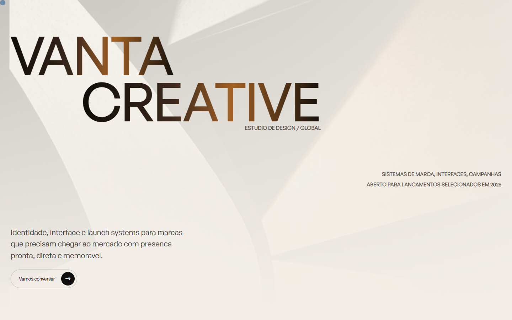

# Vanta Creative




Site conceito para um estudio premium de design, criado como projeto de portfolio.

## Sobre

A proposta da Vanta Creative e manter a energia do site original em preto e branco, com tipografia grande, hover de imagens nos projetos e animacoes GSAP, mas expandir a pagina para parecer um site completo de estudio.

## Secoes

- Hero tipografico com imagem de fundo gerada por IA.
- Projetos selecionados com imagem seguindo o cursor.
- Manifesto editorial.
- Servicos em grid assimetrico.
- Metricas de impacto.
- Processo em timeline.
- Sistema visual com assets gerados por IA.
- Sobre o estudio.
- Contato e footer.

## Tecnologias

- HTML
- CSS
- JavaScript
- GSAP
- ScrollTrigger
- Remix Icon

## Checklist para subir ao GitHub

- Conteudo traduzido para PT-BR.
- Metatags basicas adicionadas.
- Favicon SVG e Apple touch icon adicionados.
- Assets locais gerados por IA dentro de `assets/`.
- Terceira cor adicionada: cobre queimado (`#B87333`).
- Scroll reveal com fallback para evitar secoes invisiveis.
- Pagina 404 personalizada.
- Layout responsivo para desktop e mobile.

## Como rodar

Abra `index.html` no navegador ou sirva a pasta com um servidor estatico:

```bash
python -m http.server 4177
```
